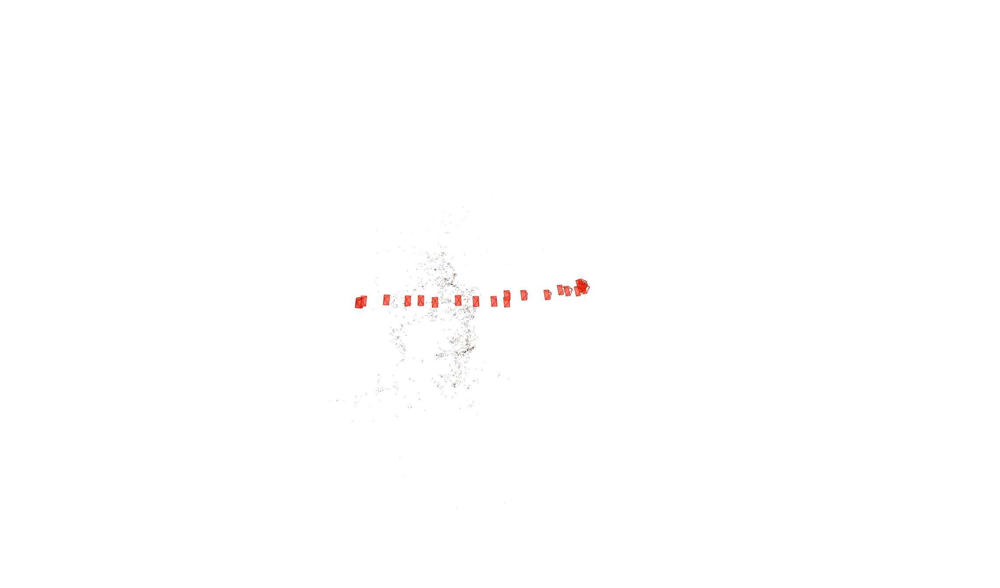
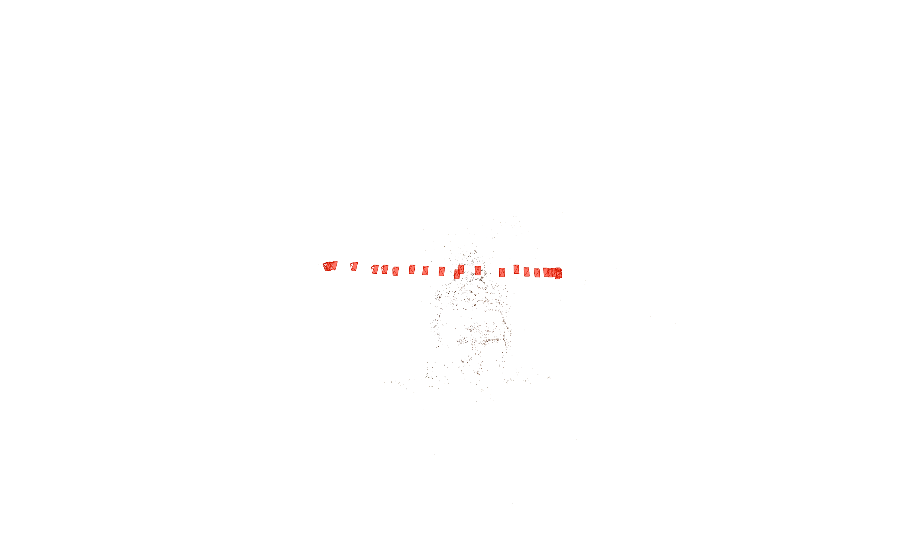
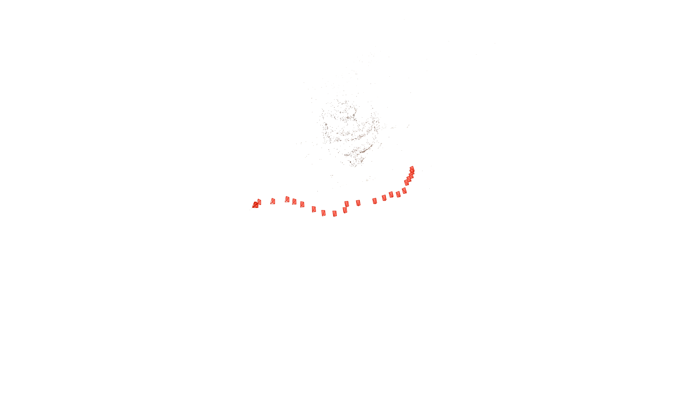
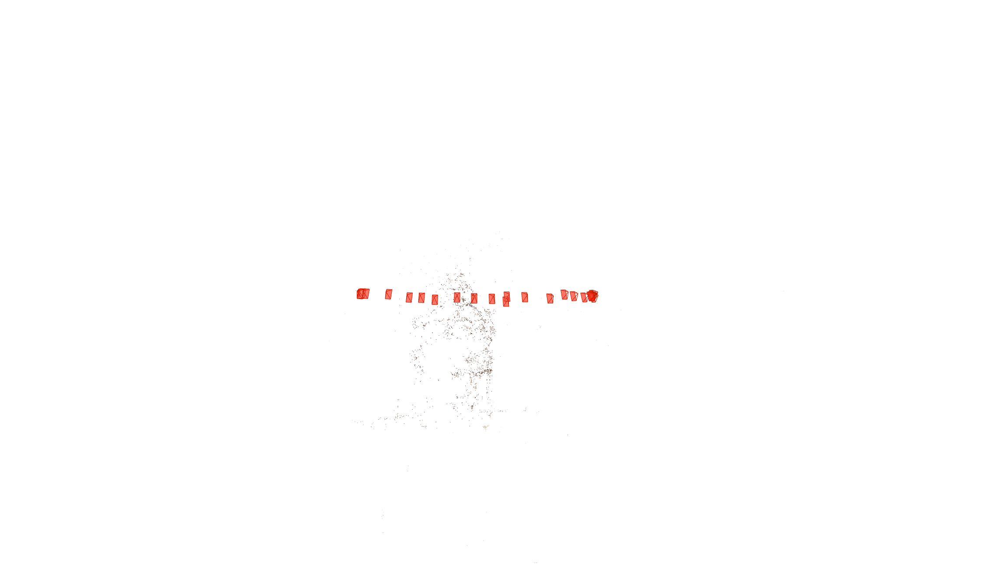
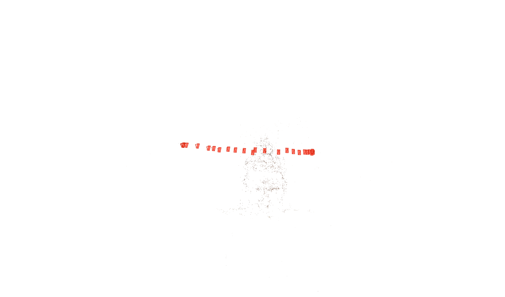
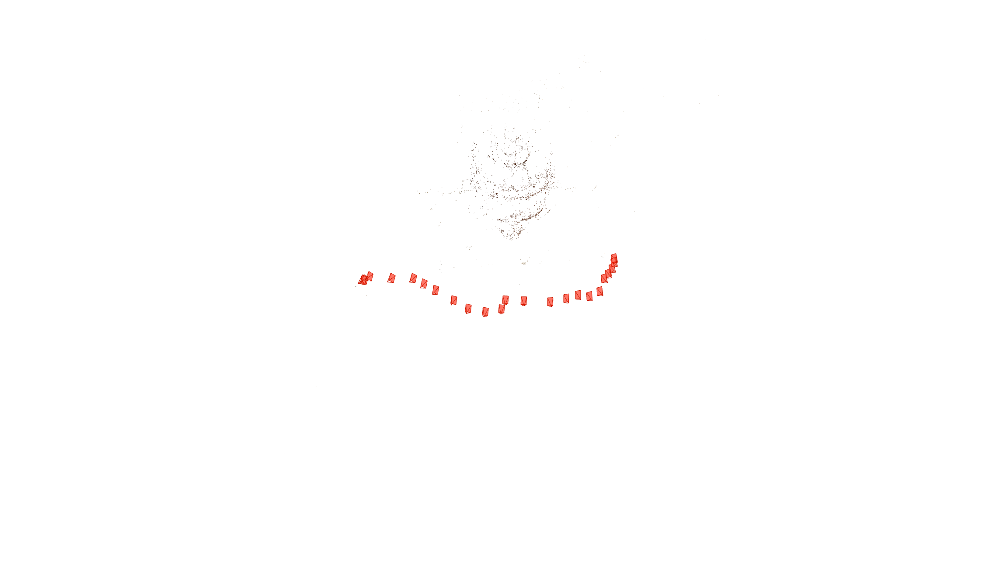

# Incremental Structure-from-Motion

A from-scratch **incremental sparse SfM** pipeline that reconstructs camera poses and a 3D landmark cloud from a monocular image sequence. The geometry stack (fundamental / essential matrices, triangulation, PnP, tracks) is implemented in Python; bundle adjustment uses **GTSAM**.

## Pipeline

```text
Images + intrinsics
  → SIFT features & pairwise matching (RANSAC F)
  → Global tracks (Union-Find)
  → Seed pair (E-matrix, cheirality, triangulation)
  → Bidirectional PnP registration + map growth
  → Retriangulation of leftover tracks
  → GTSAM bundle adjustment
  → Open3D visualization / COLMAP export
```

**Core stages**

1. **Feature matching** — SIFT + Lowe ratio test + RANSAC fundamental matrix (Sampson error). Optional SuperPoint + LightGlue front-end.
2. **Two-view geometry** — normalized 8-point `F`, essential matrix `E = Kⱼᵀ F Kᵢ`, pose hypotheses, cheirality selection.
3. **Incremental mapping** — seed triangulation, `solvePnPRansac` localization, neighbor triangulation, global retriangulation.
4. **Bundle adjustment** — robust (Huber) projection factors in GTSAM; joint pose + landmark LM optimization.
5. **Visualization / export** — Open3D viewer; COLMAP-compatible sparse models for the COLMAP GUI.

## Repository layout

```text
.
├── SFM.ipynb              # End-to-end runner notebook
├── sfm/                   # Pipeline package
│   ├── io.py              # Image + COLMAP cameras.txt loading
│   ├── geometry.py        # F / E / pose / triangulation
│   ├── matching.py        # SIFT matching
│   ├── matching_superpoint.py  # Optional SuperPoint + LightGlue
│   ├── tracks.py          # Multi-view tracks
│   ├── mapping.py         # Seed, PnP expansion, retriangulation
│   ├── ba.py              # GTSAM bundle adjustment
│   ├── viz.py             # Open3D visualization
│   ├── colmap_export.py   # Export for COLMAP GUI
│   └── rng.py             # Reproducible seeding
├── buddha_images/         # Input RGB frames
├── cameras.txt            # Per-view intrinsics (SIMPLE_RADIAL)
├── Outputs/               # Reconstruction screenshots
├── colmap_exports/        # Exported before/after-BA models
└── requirements.txt
```

## Requirements

- Python 3.10+
- OpenCV
- NumPy
- Open3D
- GTSAM
- Jupyter

Optional:

- PyTorch (CUDA recommended)
- LightGlue + SuperPoint

```bash
pip install -r requirements.txt

# Optional SuperPoint / LightGlue frontend
pip install git+https://github.com/cvg/LightGlue.git
```

COLMAP is only required if you want to inspect exported models in the COLMAP GUI.

---

## Quick Start

1. Place your images inside `buddha_images/`.
2. Provide a matching `cameras.txt` in COLMAP text format (`SIMPLE_RADIAL`).
3. Open and run `SFM.ipynb`.

## COLMAP GUI

Exported models are written to

```
colmap_exports/before_ba
colmap_exports/after_ba
```

Visualize them with

```bash
colmap gui \
  --database_path buddha_images/database.db \
  --image_path buddha_images \
  --import_path colmap_exports/after_ba
```

The exporter regenerates the binary files to avoid stale `.bin` models.

---

# Example Results

On a 24-view image sequence with denser SIFT settings (illustrative; exact numbers depend on feature parameters and RANSAC randomness):

| Metric | Value |
|---------|------:|
| Registered Images | 24 / 24 |
| Sparse Landmarks (Pre-BA) | ~5.5k |
| Bundle Adjustment Cost Reduction | ~60–70% |
| Final Reprojection RMSE | ~3–4 px |

## Before Bundle Adjustment

### View 1



### View 2



### View 3



---

## After Bundle Adjustment

### View 1



### View 2



### View 3



The figures illustrate the recovered sparse point cloud and estimated camera trajectory before and after bundle adjustment. Bundle adjustment jointly optimizes camera poses and 3D landmarks by minimizing reprojection error, producing a more geometrically consistent reconstruction.

---

## Design Notes

- Camera intrinsics are assumed to be known from `cameras.txt`.
- The pipeline supports `SIMPLE_RADIAL` intrinsics, while bundle adjustment currently optimizes using a pinhole `Cal3_S2` camera model.
- Pairwise matching uses a sliding image window to reduce incorrect long-range correspondences.
- Multi-view feature tracks are built using a Union-Find data structure.
- Incremental mapping uses RANSAC-based PnP followed by retriangulation.
- Bundle adjustment uses robust Huber projection factors with Levenberg–Marquardt optimization in GTSAM.
- `set_random_seed(0)` and OpenCV single-threading improve reproducibility across RANSAC stages.

---

## Future Improvements

- Camera intrinsic optimization during bundle adjustment.
- Loop closure and pose graph optimization.
- Dense multi-view stereo reconstruction.
- GPU-accelerated feature extraction and matching.
- Hierarchical or parallel SfM for large-scale datasets.
- Integration with learned feature descriptors and differentiable bundle adjustment.
