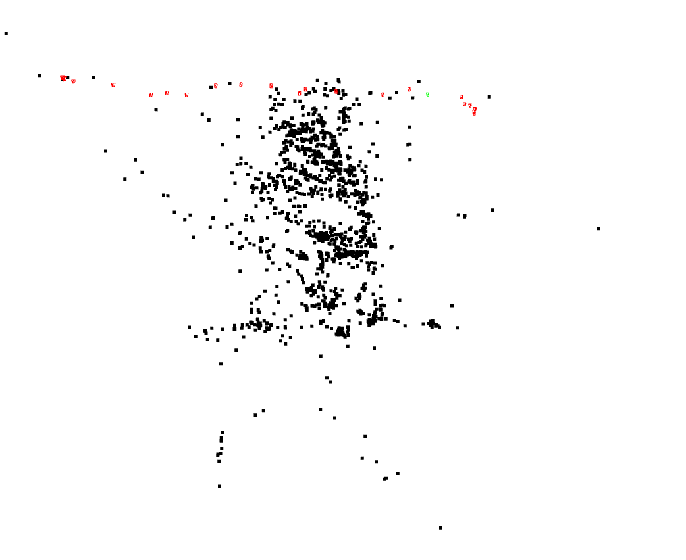
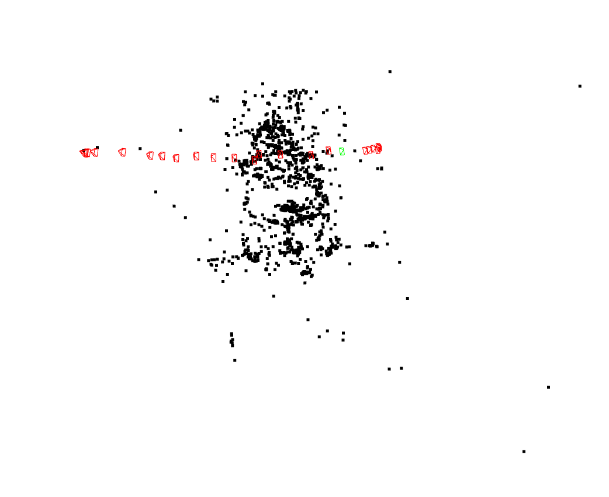

# 3D RECONSTRUCTION USING SFM
A robust Incremental Structure from Motion (SfM) pipeline implemented in Python. This project reconstructs sparse 3D geometry from monocular image sequences by estimating camera poses and triangulating 3D points. It utilizes OpenCV for feature extraction and sequential PnP tracking, and GTSAM for global Bundle Adjustment to optimize the structure and minimize drift.

# Tech Stack
- Language: Python
- Computer Vision: OpenCV (cv2)
- Optimization: GTSAM (Georgia Tech Smoothing and Mapping library)
- Numerical Computing: NumPy
- Visualization: Open3D, Matplotlib

# OUTPUTS
| Pre-Optimization | Post-Optimization |
| :---: | :---: |
|  |  |

<video src="Outputs/SfM_Demo.webm" width="800" controls autoplay loop muted>
  Your browser does not support the video tag.
</video>
